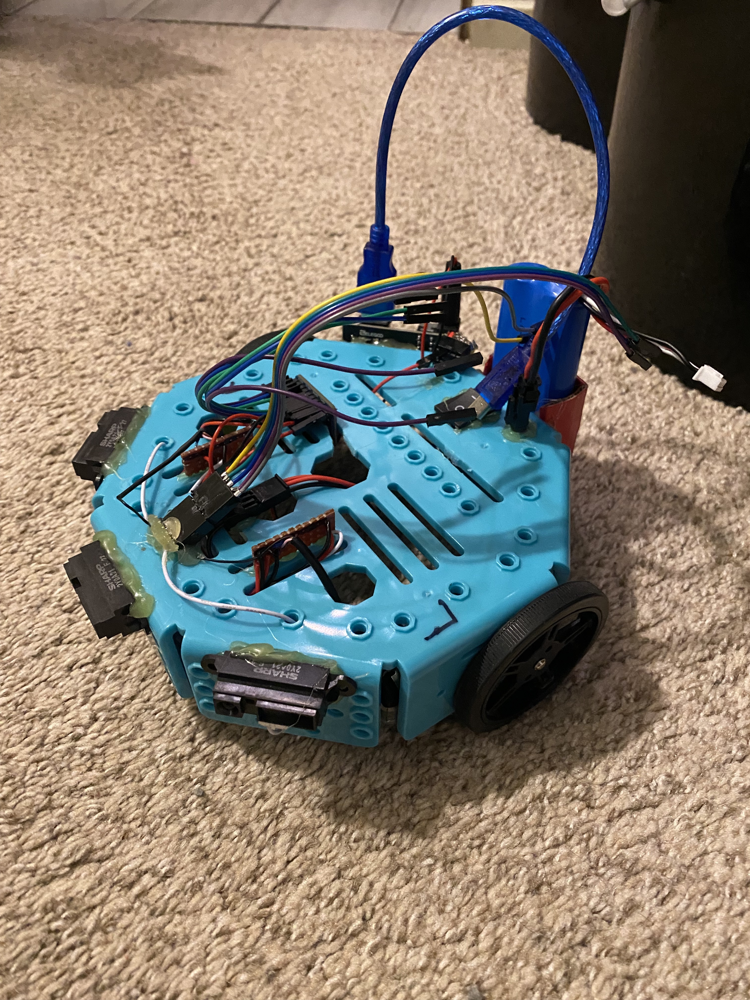
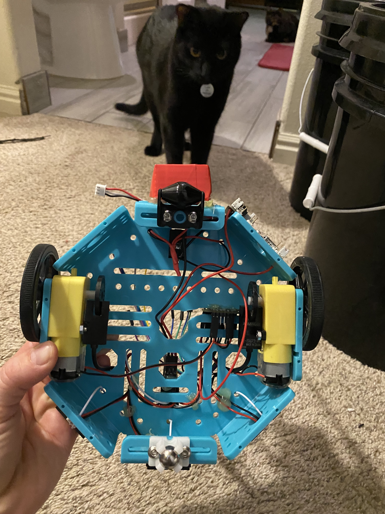

# rubybrown Team
- Stephanie Georges
- Jack Sorenson
- Brock Brown

## Proposal
Hello world. Within this repository lies code to guide one little rover (dubbed Hercules), 
whose purpose is two-fold: to autonomously navigate and complete an obstacle course, and 
to win the gold at a drag race. This project is written in C and works with the STM32F0x8 
Discovery microcontroller by STMicroelectronics. All major components used to build our 
rover can be found in the Bill of Materials, but largely feature simple wheels attached 
to TT motors and infrared sensors to detect obstacles. Specific techniques featured in this 
project include general purpose input/output (GPIO), external interrupts (EXTI), 
timer interrupts, pulse-width modulation (PWM), and proportional-integral-derivative 
motor control (PID). This project encompasses much of the knowledge conveyed in CS/CE6780, 
taught at the University of Utah in the spring of 2023.
To read the specifics of our proposal in the browser, click [here](https://github.com/stefinfection/rubybrown/blob/master/proposal.md).

## Milestone Reports
- [Milestone 1](./milestone_01/report.md)
- [Milestone 2](./milestone_02/report.md)
- Subsequent milestone reports were conveyed in person
- [Final Report](./milestone_N/report.md)

## Repo
*A quick note about the code repos: we initially used the OS-agnostic setup, then switched to 
using Kiel Vision on Windows due to what we suspect were high level clock issues with the former.
We'd encourage interested parties to review the effective-telegram repository in particular, 
to see our efforts of setting everything manually.*
- [Project Repo](https://github.com/stefinfection/rubybrown)
- ssh clone: `git clone git@github.com:stefinfection/rubybrown.git`
- [Final Code Repo](https://github.com/brownbr61/hercules) - pure hardcoded, messy functionality
- ssh clone: `git clone git@github.com:brownbr61/hercules.git`
- [Penultimate Code Repo](https://github.com/brownbr61/ploop-d-doop) - builds on Windows
- ssh clone: 'git clone git@github.com/brownbr61/ploop-d-doop'
- [Progress Code Repo](https://github.com/brownbr61/effective-telegram) - builds on Linux
- ssh clone: `git clone git@github.com:brownbr61/effective-telegram.git`

## Hercules

