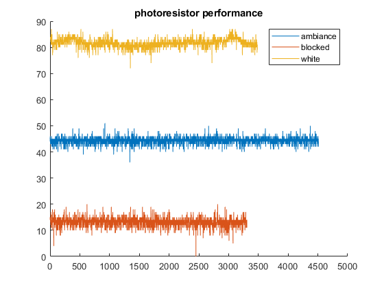

<!DOCTYPE html
  PUBLIC "-//W3C//DTD HTML 4.01 Transitional//EN">
<html><body>
<h2>Contents</h2>
<ul><li><a href="#1">clear all</a></li><li><a href="#2">Photo Resistor data</a></li></ul>
<h2 id="1">clear all</h2><pre class="codeinput">clc; clear; close all;
</pre><h2 id="2">Photo Resistor data</h2><pre class="codeinput">phores_ambiance = csvread("phores-ambiance.csv");
phores_blocked = csvread("phores-blocked.csv");
phores_white = csvread("phores-white-paper.csv");

figure
hold on;
plot(phores_ambiance)
plot(phores_blocked)
plot(phores_white)
title("photoresistor performance")

legend("ambiance","blocked","white")

disp("These data are much cleaner &amp; thusly don't need as much analysis as the whisker_data.")
</pre><pre class="codeoutput">These data are much cleaner &amp; thusly don't need as much analysis as the whisker_data.
</pre> 
 <a href="https://www.mathworks.com/products/matlab/">Published with MATLAB&reg; R2022a</a> 

</body></html>