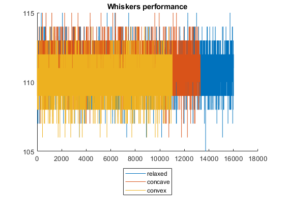
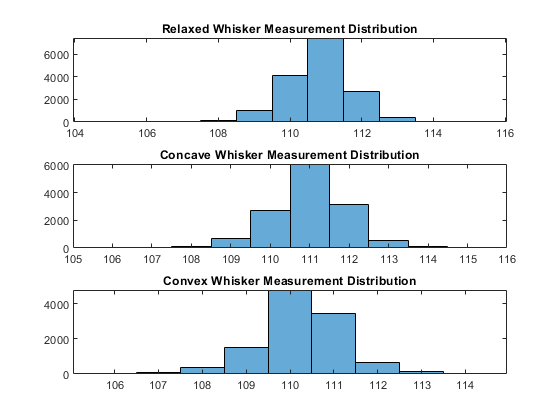
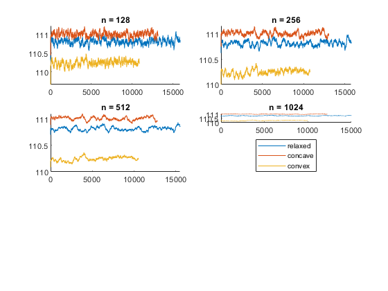
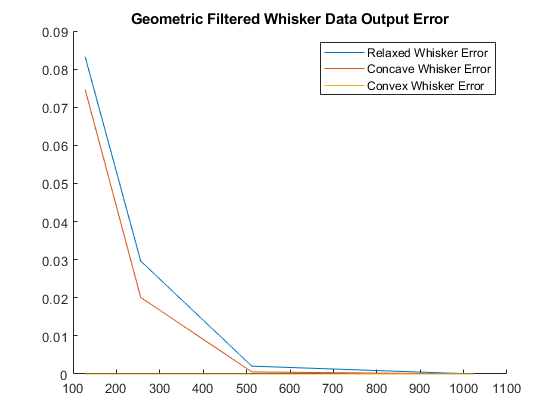
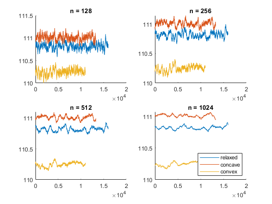
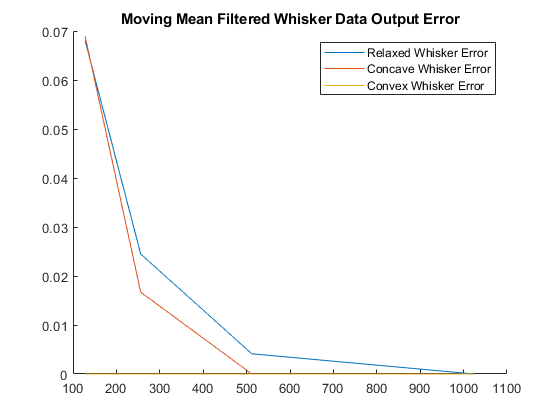
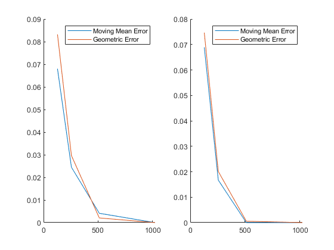
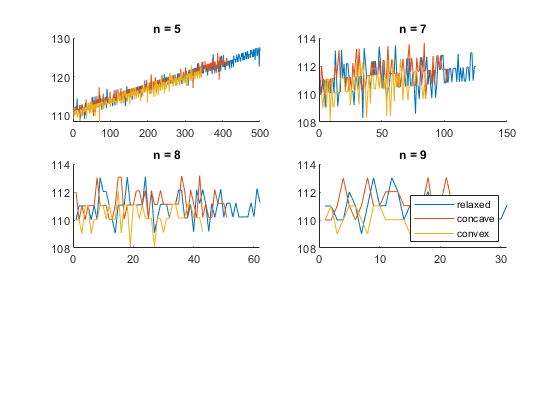

<!DOCTYPE html
  PUBLIC "-//W3C//DTD HTML 4.01 Transitional//EN">
<html><head>
      <meta http-equiv="Content-Type" content="text/html; charset=utf-8">
   <!--
This HTML was auto-generated from MATLAB code.
To make changes, update the MATLAB code and republish this document.
      --><title>whisker_data</title><meta name="generator" content="MATLAB 9.12"><link rel="schema.DC" href="http://purl.org/dc/elements/1.1/"><meta name="DC.date" content="2023-03-17"><meta name="DC.source" content="whisker_data.m"></head><body>
<h2>Contents</h2>
<ul><li><a href="#1">clear all</a></li><li><a href="#2">Unfiltered Whisker Data</a></li><li><a href="#3">Unfiltered Whisker Data Statistics</a></li><li><a href="#4">Filtered Whisker Data - Geometric Filter</a></li><li><a href="#5">Filtered Whisker Data - Moving Mean</a></li><li><a href="#6">Geometric - Moving Mean comparison</a></li><li><a href="#7">Filtered Whisker Data - Computationally-Cheap</a></li></ul>
<h2 id="1">clear all</h2><pre class="codeinput">clc; clear; close all;
</pre><h2 id="2">Unfiltered Whisker Data</h2><pre class="codeinput">whisker_relaxed = csvread("relaxed.csv");
whisker_concave = csvread("bent-concave.csv");
whisker_convex = csvread("bent-convex.csv");

figure
hold on;
plot(whisker_relaxed)
plot(whisker_concave)
plot(whisker_convex)
title("Whiskers performance")

legend("relaxed","concave","convex","Location","southoutside")
</pre> <h2 id="3">Unfiltered Whisker Data Statistics</h2><pre class="codeinput">figure
hold on;

relaxedMean = mean(whisker_relaxed);
relaxedStd = std(whisker_relaxed);
concaveMean = mean(whisker_concave);
concaveStd = std(whisker_concave);
convexMean = mean(whisker_convex);
convexStd = std(whisker_convex);

subplot(3,1,1)
histogram(whisker_relaxed)
title("Relaxed Whisker Measurement Distribution")
subplot(3,1,2)
histogram(whisker_concave)
title("Concave Whisker Measurement Distribution")
subplot(3,1,3)
histogram(whisker_convex)
title("Convex Whisker Measurement Distribution")

disp("Unfiltered Whisker Data Statistics:")
disp("relaxed whisker:")
disp(strcat("  mean: ",string(relaxedMean),"   std: ", string(relaxedStd)))
disp("relaxed concave bend:")
disp(strcat("  mean: ",string(concaveMean),"   std: ", string(concaveStd)))
disp("relaxed convex bend:")
disp(strcat("  mean: ",string(convexMean),"   std: ", string(convexStd)))

disp("Given that std(mean(samples)) = 1/sqrt(nSamples)*std(samples), we can differentiate the systems with 97% accuracy with the following sample counts:")

zScoreGoal = 2; % this gets a bit better than 97% (assuming ideal gaussian filters)
concaveSamples = (zScoreGoal * concaveStd / (concaveMean - relaxedMean))^2; % concave &amp; relaxed have the closest means
disp(strcat("  min(concave samples): ",string(concaveSamples)))
</pre><pre class="codeoutput">Unfiltered Whisker Data Statistics:
relaxed whisker:
  mean: 110.8195   std: 0.9641
relaxed concave bend:
  mean: 111.0114   std: 0.98412
relaxed convex bend:
  mean: 110.2471   std: 0.97506
Given that std(mean(samples)) = 1/sqrt(nSamples)*std(samples), we can differentiate the systems with 97% accuracy with the following sample counts:
  min(concave samples): 105.1457
</pre> <h2 id="4">Filtered Whisker Data - Geometric Filter</h2><pre>- First round of samples; simplest filter I could think of</pre><pre class="codeinput">figure
hold on;
n = [128,256,512,1024];
title("Geometrically-Filtered Whisker Data Output")
for i = 1:length(n)
  subplot(3,2,i)
  hold on;
  plot(lowPassFilter(whisker_relaxed,n(i)))
  plot(lowPassFilter(whisker_concave,n(i)))
  plot(lowPassFilter(whisker_convex,n(i)))
  title(strcat("n = ",string(n(i))))
end
legend("relaxed","concave","convex","Location","southoutside")

relaxedGeometricError = zeros([1 length(n)]);
concaveGeometricError = zeros([1 length(n)]);
convexGeometricError  = zeros([1 length(n)]);
relaxedConcaveLine = mean([relaxedMean concaveMean]); % Assuming nearly-equal std
relaxedConvexLine  = mean([relaxedMean convexMean ]); % Assuming nearly-equal std
for i = 1:length(n)
  relaxedWhiskerMean = lowPassFilter(whisker_relaxed,n(i));
  concaveWhiskerMean = lowPassFilter(whisker_concave,n(i));
  convexWhiskerMean  = lowPassFilter(whisker_convex,n(i));
  relaxedGeometricError(i) = getBayesianError(relaxedWhiskerMean,relaxedConvexLine,relaxedConcaveLine);
  concaveGeometricError(i) = getBayesianError(concaveWhiskerMean,relaxedConcaveLine,256);
  convexGeometricError(i)  = getBayesianError(convexWhiskerMean,0,relaxedConcaveLine);
end

figure
hold on;
title("Geometric Filtered Whisker Data Output Error")
plot(n,relaxedGeometricError);
plot(n,concaveGeometricError);
plot(n,convexGeometricError);
legend("Relaxed Whisker Error","Concave Whisker Error","Convex Whisker Error");
</pre>  <h2 id="5">Filtered Whisker Data - Moving Mean</h2>
this can be implemented fairly easily w/ an array of size n.  sum -= array.pop() - newData;  array.plop(newData);
<pre class="codeinput">figure
hold on;
n = [128,256,512,1024];
title("Moving Mean Filtered Whisker Data Output")
for i = 1:length(n)
  subplot(2,2,i)
  hold on;
  plot(movmean(whisker_relaxed,n(i)))
  plot(movmean(whisker_concave,n(i)))
  plot(movmean(whisker_convex,n(i)))
  title(strcat("n = ",string(n(i))))
end
legend("relaxed","concave","convex","Location","southeast")

relaxedMovingMeanError = zeros([1 length(n)]);
concaveMovingMeanError = zeros([1 length(n)]);
convexMovingMeanError  = zeros([1 length(n)]);
relaxedConcaveLine = mean([relaxedMean concaveMean]); % Assuming nearly-equal std
relaxedConvexLine  = mean([relaxedMean convexMean ]); % Assuming nearly-equal std
for i = 1:length(n)
  relaxedWhiskerMean = movmean(whisker_relaxed,n(i));
  concaveWhiskerMean = movmean(whisker_concave,n(i));
  convexWhiskerMean  = movmean(whisker_convex,n(i));
  relaxedMovingMeanError(i) = getBayesianError(relaxedWhiskerMean,relaxedConvexLine,relaxedConcaveLine);
  concaveMovingMeanError(i) = getBayesianError(concaveWhiskerMean,relaxedConcaveLine,256);
  convexMovingMeanError(i)  = getBayesianError(convexWhiskerMean,0,relaxedConcaveLine);
end

figure
hold on;
title("Moving Mean Filtered Whisker Data Output Error")
plot(n,relaxedMovingMeanError);
plot(n,concaveMovingMeanError);
plot(n,convexMovingMeanError);
legend("Relaxed Whisker Error","Concave Whisker Error","Convex Whisker Error");
</pre>  <h2 id="6">Geometric - Moving Mean comparison</h2><pre class="codeinput">n = [128,256,512,1024];

figure;
title("Geometric vs Moving Mean Error Comparison")
subplot(1,2,1)
hold on
plot(n, relaxedMovingMeanError);
plot(n, relaxedGeometricError);
legend("Moving Mean Error", "Geometric Error")

subplot(1,2,2)
hold on
plot(n, concaveMovingMeanError);
plot(n, concaveGeometricError);
legend("Moving Mean Error", "Geometric Error")

disp("It seems like a moving mean is a better filter than a geometric filter")
</pre><pre class="codeoutput">It seems like a moving mean is a better filter than a geometric filter
</pre> <h2 id="7">Filtered Whisker Data - Computationally-Cheap</h2><pre>- Since multiplication/division is expensive, divide by power of two (bit shift)</pre><pre class="codeinput">figure
hold on;
n = [5,7,8,9];
title("Quick-Filtered Whisker Data Output")
for i = 1:length(n)
  subplot(3,2,i)
  hold on;
  plot(quickFilter(whisker_relaxed,n(i)))
  plot(quickFilter(whisker_concave,n(i)))
  plot(quickFilter(whisker_convex,n(i)))
  title(strcat("n = ",string(n(i))))
end
legend("relaxed","concave","convex","Location","southeast")
</pre> 
 <a href="https://www.mathworks.com/products/matlab/">Published with MATLAB&reg; R2022a</a> 

<!--
##### SOURCE BEGIN #####
%% clear all

clc; clear; close all;

%% Unfiltered Whisker Data

whisker_relaxed = csvread("relaxed.csv");
whisker_concave = csvread("bent-concave.csv");
whisker_convex = csvread("bent-convex.csv");

figure
hold on;
plot(whisker_relaxed)
plot(whisker_concave)
plot(whisker_convex)
title("Whiskers performance")

legend("relaxed","concave","convex","Location","southoutside")

%% Unfiltered Whisker Data Statistics
figure
hold on;

relaxedMean = mean(whisker_relaxed);
relaxedStd = std(whisker_relaxed);
concaveMean = mean(whisker_concave);
concaveStd = std(whisker_concave);
convexMean = mean(whisker_convex);
convexStd = std(whisker_convex);

subplot(3,1,1)
histogram(whisker_relaxed)
title("Relaxed Whisker Measurement Distribution")
subplot(3,1,2)
histogram(whisker_concave)
title("Concave Whisker Measurement Distribution")
subplot(3,1,3)
histogram(whisker_convex)
title("Convex Whisker Measurement Distribution")

disp("Unfiltered Whisker Data Statistics:")
disp("relaxed whisker:")
disp(strcat("  mean: ",string(relaxedMean),"   std: ", string(relaxedStd)))
disp("relaxed concave bend:")
disp(strcat("  mean: ",string(concaveMean),"   std: ", string(concaveStd)))
disp("relaxed convex bend:")
disp(strcat("  mean: ",string(convexMean),"   std: ", string(convexStd)))

disp("Given that std(mean(samples)) = 1/sqrt(nSamples)*std(samples), we can differentiate the systems with 97% accuracy with the following sample counts:")

zScoreGoal = 2; % this gets a bit better than 97% (assuming ideal gaussian filters)
concaveSamples = (zScoreGoal * concaveStd / (concaveMean - relaxedMean))^2; % concave & relaxed have the closest means
disp(strcat("  min(concave samples): ",string(concaveSamples)))

%% Filtered Whisker Data - Geometric Filter
%  - First round of samples; simplest filter I could think of

figure
hold on;
n = [128,256,512,1024];
title("Geometrically-Filtered Whisker Data Output")
for i = 1:length(n)
  subplot(3,2,i)
  hold on;
  plot(lowPassFilter(whisker_relaxed,n(i)))
  plot(lowPassFilter(whisker_concave,n(i)))
  plot(lowPassFilter(whisker_convex,n(i)))
  title(strcat("n = ",string(n(i))))
end
legend("relaxed","concave","convex","Location","southoutside")

relaxedGeometricError = zeros([1 length(n)]);
concaveGeometricError = zeros([1 length(n)]);
convexGeometricError  = zeros([1 length(n)]);
relaxedConcaveLine = mean([relaxedMean concaveMean]); % Assuming nearly-equal std
relaxedConvexLine  = mean([relaxedMean convexMean ]); % Assuming nearly-equal std
for i = 1:length(n)
  relaxedWhiskerMean = lowPassFilter(whisker_relaxed,n(i));
  concaveWhiskerMean = lowPassFilter(whisker_concave,n(i));
  convexWhiskerMean  = lowPassFilter(whisker_convex,n(i));
  relaxedGeometricError(i) = getBayesianError(relaxedWhiskerMean,relaxedConvexLine,relaxedConcaveLine);
  concaveGeometricError(i) = getBayesianError(concaveWhiskerMean,relaxedConcaveLine,256);
  convexGeometricError(i)  = getBayesianError(convexWhiskerMean,0,relaxedConcaveLine);
end

figure
hold on;
title("Geometric Filtered Whisker Data Output Error")
plot(n,relaxedGeometricError);
plot(n,concaveGeometricError);
plot(n,convexGeometricError);
legend("Relaxed Whisker Error","Concave Whisker Error","Convex Whisker Error");

%% Filtered Whisker Data - Moving Mean
% this can be implemented fairly easily w/ an array of size n.
%  sum -= array.pop() - newData;
%  array.plop(newData);

figure
hold on;
n = [128,256,512,1024];
title("Moving Mean Filtered Whisker Data Output")
for i = 1:length(n)
  subplot(2,2,i)
  hold on;
  plot(movmean(whisker_relaxed,n(i)))
  plot(movmean(whisker_concave,n(i)))
  plot(movmean(whisker_convex,n(i)))
  title(strcat("n = ",string(n(i))))
end
legend("relaxed","concave","convex","Location","southeast")

relaxedMovingMeanError = zeros([1 length(n)]);
concaveMovingMeanError = zeros([1 length(n)]);
convexMovingMeanError  = zeros([1 length(n)]);
relaxedConcaveLine = mean([relaxedMean concaveMean]); % Assuming nearly-equal std
relaxedConvexLine  = mean([relaxedMean convexMean ]); % Assuming nearly-equal std
for i = 1:length(n)
  relaxedWhiskerMean = movmean(whisker_relaxed,n(i));
  concaveWhiskerMean = movmean(whisker_concave,n(i));
  convexWhiskerMean  = movmean(whisker_convex,n(i));
  relaxedMovingMeanError(i) = getBayesianError(relaxedWhiskerMean,relaxedConvexLine,relaxedConcaveLine);
  concaveMovingMeanError(i) = getBayesianError(concaveWhiskerMean,relaxedConcaveLine,256);
  convexMovingMeanError(i)  = getBayesianError(convexWhiskerMean,0,relaxedConcaveLine);
end

figure
hold on;
title("Moving Mean Filtered Whisker Data Output Error")
plot(n,relaxedMovingMeanError);
plot(n,concaveMovingMeanError);
plot(n,convexMovingMeanError);
legend("Relaxed Whisker Error","Concave Whisker Error","Convex Whisker Error");

%% Geometric - Moving Mean comparison
n = [128,256,512,1024];

figure;
title("Geometric vs Moving Mean Error Comparison")
subplot(1,2,1)
hold on
plot(n, relaxedMovingMeanError);
plot(n, relaxedGeometricError);
legend("Moving Mean Error", "Geometric Error")

subplot(1,2,2)
hold on
plot(n, concaveMovingMeanError);
plot(n, concaveGeometricError);
legend("Moving Mean Error", "Geometric Error")

disp("It seems like a moving mean is a better filter than a geometric filter")

%% Filtered Whisker Data - Computationally-Cheap
%  - Since multiplication/division is expensive, divide by power of two (bit shift)

figure
hold on;
n = [5,7,8,9];
title("Quick-Filtered Whisker Data Output")
for i = 1:length(n)
  subplot(3,2,i)
  hold on;
  plot(quickFilter(whisker_relaxed,n(i)))
  plot(quickFilter(whisker_concave,n(i)))
  plot(quickFilter(whisker_convex,n(i)))
  title(strcat("n = ",string(n(i))))
end
legend("relaxed","concave","convex","Location","southeast")

##### SOURCE END #####
--></body></html>