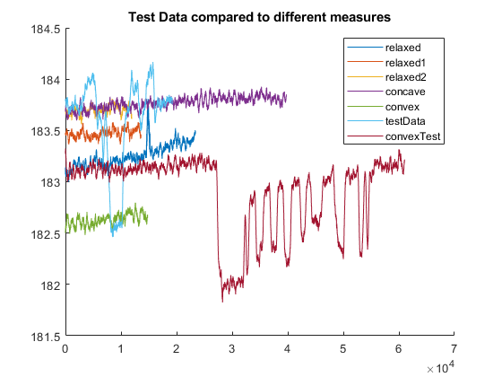

<!DOCTYPE html
  PUBLIC "-//W3C//DTD HTML 4.01 Transitional//EN">
<html><body>
<h2>Contents</h2>
<ul><li><a href="#1">clear all</a></li><li><a href="#2">Unfiltered Whisker Data</a></li></ul>
<h2 id="1">clear all</h2><pre class="codeinput">clc; clear; close all;
</pre><h2 id="2">Unfiltered Whisker Data</h2><pre class="codeinput">relaxed = csvread("whisker-short-length-relaxed.csv");
relaxed1 = csvread("whisker-short-length-relaxed-1.csv");
relaxed2 = csvread("whisker-short-length-relaxed-2.csv");
concave = csvread("whisker-short-length-concave.csv");
convex = csvread("whisker-short-length-convex.csv");
testData = csvread("whisker-short-length-test.csv");
convexTest = csvread("whisker-short-length-test-convex.csv");

figure;
hold on;
n = 256;
plot(movmean(relaxed,n))
plot(movmean(relaxed1,n))
plot(movmean(relaxed2,n))
plot(movmean(concave,n))
plot(movmean(convex,n))
plot(movmean(testData,n))
plot(movmean(convexTest,n))
title("Test Data compared to different measures")

legend("relaxed","relaxed1","relaxed2","concave","convex","testData","convexTest");
</pre> 
 <a href="https://www.mathworks.com/products/matlab/">Published with MATLAB&reg; R2022a</a> 

</body></html>