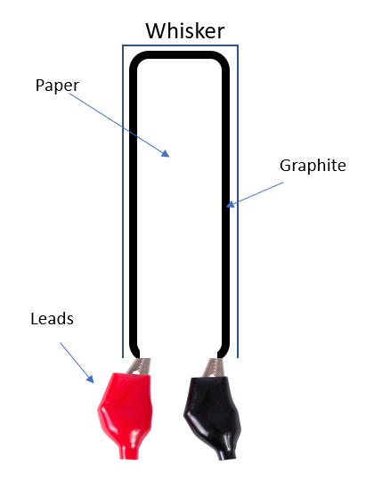
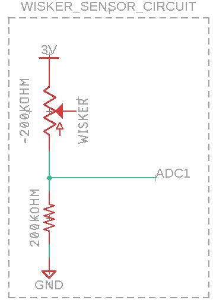
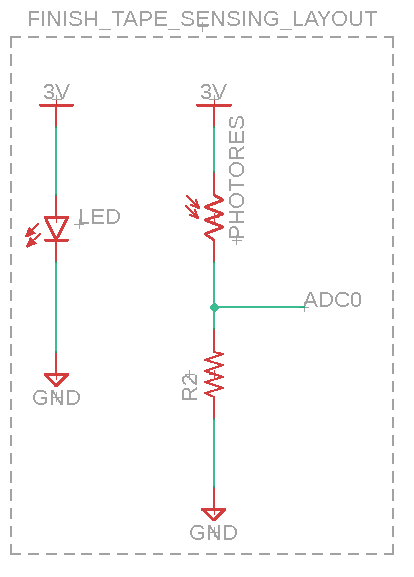

# Milestone 01 Report

### Summary of Progress
This week team Ruby Brown made some major and exciting progress! 
We successfully completed the ADC/DAC lab (in place of the I2C lab - 
thank you for the permission to switch due dates for those), 
which enabled us to record and read in values from both our whiskers and light sensors. 
This was an essential step to ensure that our homemade whiskers would give us reproducibly different data: 
i.e. that a bent whisker (indicating sensing an obstacle) and relaxed whisker (indicating no obstacle) 
would create measurably diverging values. Below we have analyzed and documented the collected data itself,
as well as the process and techniques utilized to produce it (even with a video!). We feel confident that our homemade whiskers
will indeed be up to the task of sensing obstacles with a higher ADC bit resolution, signal filtering, and 
calibration prior to each run.
Our light sensing additionally worked well, as expected. In addition to the major progress of setting up a system to capture our sensor data, we assembled our motors, wheels, and encoders 
onto our chassis. 

### Data sensing and collection
Both the ADC and UART labs were critical for collecting our sensor data. At a high level, 
we used our ADC lab code with some minor modifications
to read in the data, as well as the UART lab code to write out the data to a CSV file. We then visualized our data to ensure that our measured 
values for different states were significantly different. We recorded a video of our data capture process 
with a walkthrough that you can view [here](https://photos.google.com/share/AF1QipMbT5UKQWLLFyn-lpIWxlGs-L8LXLGSxk-tUocNoKHhJ5w16Ysk_vUWKtVxiH8sKg/photo/AF1QipMzzRM0rEScpkYgwwi67VyrzjysNWQ2cfoRCRBz?key=cjNVSWQybS11dFdHRE5mcklYZm5kWjMxLWpmOEdR).

#### Whisker Sensing
To read in our whisker data, we constructed homemade whiskers (rectangular pieces of computer paper 
with graphite traces drawn on them) of varying lengths, with alligator clips connected to the
ends of the graphite trace reading into the STM32 Discovery board ADC. The whisker acts similarly to the potentiometer in the ADC lab and will produce a voltage change (ΔV) across itself when bent. 
Using the design in Figure 1, the ΔV only amounted to roughly 10 mV for a 45° bend. 
This delicate change means the ADC bit resolution has to be high enough to read ΔV in order to 
be viable. Using 8-bit resolution and a 3V supply, we can calculate the minimum ΔV = 11.7 mV. 
While we used 8-bit depth in our data gathering experiments in this report, we recognize our only 
option from here is to switch to 12-bit resolution in the STM32 for a minimum ΔV = 0.732 mV. 
This will allow for our paper/graphite whisker to be viable.

*Figure 1: Whisker Schematic*

*Figure 2: Whisker Sensor Circuit*

The processed data is viewable [here](./processed_data/whisker_data.md) (round 1)
and [here](./processed_data_rnd2/html/whisker_data.md) (round 2) and
[here](./processed_data_rnd2/html/whisker_short_data.md) (round 3). 

The raw data is viewable [here](./raw_data/).

#### Light Sensing
While we will use the whisker sensing to sense obstacles, we will use light sensing 
to make the rover stops at the finish line by detecting a change in reflective light from an onboard LED source.
The comparison is the light reflected from the ground and a distinctly colored piece of tape marking the finish. 
The method tested for light sensing itself is a white LED and a photoresistor. The photoresistor was the obvious 
choice for simplicity since it can be set up the same way as the whiskers as depicted in Figure 3.

*Figure 3: Finish Tape Sensing Layout*

To ensure we could read in light sensing data, we first hooked up a photoresistor to the STM Discovery ADC, and 
illuminated the on-board LEDs at different thresholds of light intensity. This idea was borrowed directly 
from lab 6 (using almost identical code but swapping a photoresistor for the potentiometer) and we've included a video 
of our setup at this [link](https://photos.google.com/share/AF1QipMFj47mQHgleSL3aE-hg-6nYcOL0C9v2cWipQ0tjKIs9gNILWhmQ5A92I1CtWVuLw?key=T01FRlFLd3lWOFlXZVV3Yk9lRmt0RGdtWUdVUl9B). After verifying that our system would work, we again wrote our measured values
over a UART serial connection. 

The processed data and analysis is viewable [here](./processed_data/photo_resistor_data.md) (round 1)
and [here](./processed_data_rnd2/html/photo_resistor_data.md) (round 2). Gee-wizz does that data look clean!

Again the raw data is viewable [here](./raw_data/).

### Chassis Construction and Encoding Lessons
We assembled our wheels and motors on our chassis, along with our encoders. One thing we
didn't realize when writing our intial proposal for this setup with these encoders, is that 
we would also need a photointerruptor. As such, we've updated our BoM with one, and will be ordering it this week.

### Code
You can see our ADC-sensing and UART-writing gicode [here](https://github.com/brownbr61/tattle-tale/blob/master/Core/Src/main.c) and our collection code [here](../scripts/logBytes.py). 