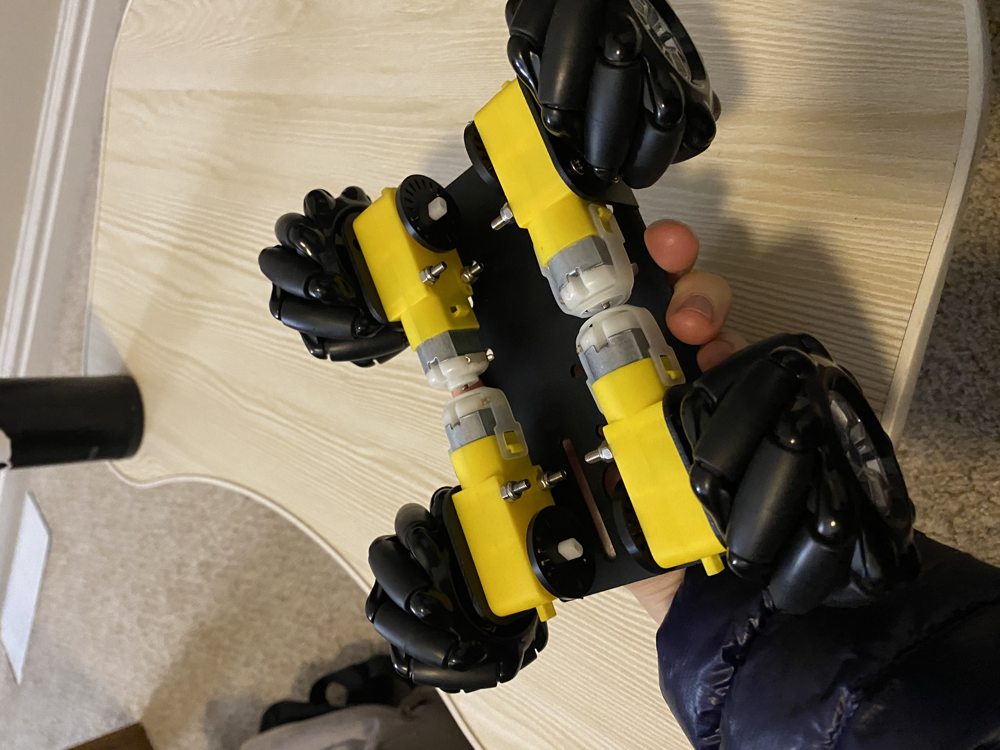
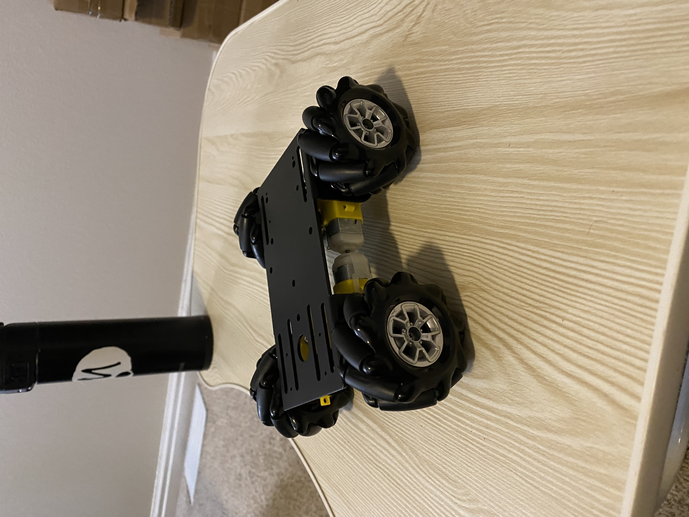

# Milestone 01 Report

### Summary of Progress
This week team Ruby Brown made some exciting progress! 
We successfully completed the ADC/DAC lab (in place of the I2C lab - 
thank you for the permission to switch due dates for those), 
which enabled us to record and read in values from both our whiskers and light sensors. 
This was an essential step to ensure that our homemade whiskers would give us reproducibly different data: 
i.e. that a bent whisker (indicating sensing an obstacle) and relaxed whisker (indicating no obstacle) 
would create measurably diverging values. Below we have analyzed and documented the collected data itself,
as well as the process and techniques utilized to produce it. We feel confident that our homemade whiskers
do indeed produce differing values according to their different states (after applying a filter), but note 
that calibration prior to each sensing run will be critical for proper performance.
Our light sensing additionally worked well, as expected. In addition to setting up a system to capture our sensor data, we assembled our motors, wheels, and encoders 
onto our chassis. A photo of this is also included below. 

### Data sensing and collection
Both the ADC and UART labs were critical for collecting our sensor data. At a high level, 
we used our ADC lab code with some minor modifications (namely, we used a larger 12-bit depth to increase sensitivity)
to read in the data, as well as the UART lab code to write out the data to a CSV file. We then visualized our data to ensure that our measured values for different states were significantly different.

#### Whisker Sensing
To read in our whisker data, we constructed homemade whiskers (rectangular pieces of computer paper 
with graphite traces drawn on them) of varying lengths, with alligator clips connected to the
ends of the graphite trace reading into the STM32 Discovery board ADC.
A schematic of this can be seen in Fig 1. We then wrote out the measured values via 
the UART device serially connected another computer.

*JACK EDIT/ADD ABOVE AND ADD SCHEMATIC HERE*
Fig 1

The processed data is viewable [here](html/milestone_01/whisker_data.html).
The raw data is viewable [here](https://github.com/stefinfection/rubybrown/milestone_01/raw_data).

#### Light Sensing
To ensure we could read in light sensing data, we first hooked up an IR sensor to the STM Discovery ADC, and 
illuminated the on-board LEDs at different thresholds of light intensity. This idea was borrowed directly 
from lab 6 (using almost identical code but swapping an IR sensor for the potentiometer) and we've included a video 
of our setup at this [link](ADD_LINK). After verifying that our system would work, we again wrote our measured values
over a UART serial connection. 

The processed data and analysis is viewable [here](/html/milestone_01/photo_resistor_data.html).
Again the raw data is viewable [here](https://github.com/stefinfection/rubybrown/milestone_01/raw_data).

### Chassis Construction and Encoding Lessons
We assembled our wheels and motors on our chassis, along with our encoders. One thing we
didn't realize when writing our intial proposal for this setup with these encoders, is that 
we would also need a photointerlruptor. As such, we've updated our BoM with one, and will be ordering it this week.

### Code
You can see our ADC-sensing code [here](../scripts/DAC_sensing.c) and our collection code [here](../scripts/logBytes.py). 