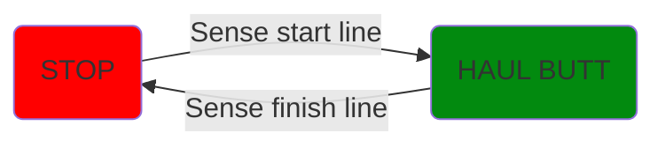

# Drag Race Approach
## Process Design - The Lightning McQueen _(I am speed!)_
The Rover will take an input of distance and wait for the "Go" button to be pressed. Upon detection of the stimuli, it will burn out straight forward until $x < 100\%$ of total distance is reached, at which point it will begin to slow down. The Rover will stop upon detection of the presence of the end line through its LED light detectors.

## Physical Design - Frankensteined [RC car](https://a.co/d/haKVwfe)
The RC car will have the RF module removed, and the STM32 will replace the PWM signal for both steering *and* power. The PWM signal will likely have distinct periods, as one will tie directly as input to the servo motor, and the other will serve as input to the ESC (Electronic Speed Controller). The RC car turned dragster will also have photo-voltaic sensors attached to its undercarriage, which will provide the `STOP` signal to the STM32, which will then stop Frankensteined RC car.

We *could* complete the Drag Race with obstacle course chassis & its associated physical design, but we wanted to _Drag our Race_, so we thought of the specialization solution. In doing this, we will encounter the following *additional* challenges:
- 2 new PWMs to which our STM32 will need to be reprogrammed
  - measurement of the PWMs
- Faster response to the analog photovoltaic sensor (due to increased speed).
- Greater sensitivity to PWM error
  - error in left\right servo steering will be harder to detect & correct.

## Pinout Selection
[See Spreadsheet](https://docs.google.com/spreadsheets/d/1AnxDkX1Bj35UQd2eEUx7PI9iqKJ5ZXWnK849a93FjlY/edit?usp=sharing)

## Finite State Machines
