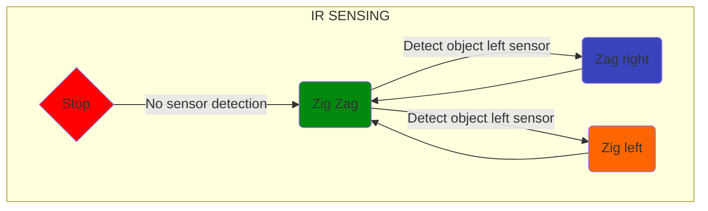

# Obstacle Course Design Plan

## Process Design - Left-Hand Rule
Rover first turns $90^o$ left, then follows start line until colliding with the wall, at which point the rover maintains contact on its left side with the wall until detection of end line.
### Complications:
- Rover will need $2+$ whiskers on its left side of differing lengths. one contact will indicate adequate proximity, two contacts will indicate excessive proximity to the wall. No contact will indicate inadequate proximity and the rover will turn left until contact is found.
- Rover will need to follow the start line, and be capable of distinguishing start & end lines.
- Rover _may_ depart from & return to start line in order to avoid a box placed on the start line.
- Brute-force method maximizes minimum course traversal time.

## Physical Design - The Rover
The Rover will consist of the [octagon chassis](https://www.adafruit.com/product/4466) with whiskers to detect the presence of an obstruction. It will use the data received from its whiskers to autonomously navigate the obstacle course until it crosses the finish line, which it will detect with photo-voltaic sensors attached to the bottom of the frame.

## Pinout Selection
[See Spreadsheet](https://docs.google.com/spreadsheets/d/1AnxDkX1Bj35UQd2eEUx7PI9iqKJ5ZXWnK849a93FjlY/edit?usp=sharing)

## Finite State Machine

  